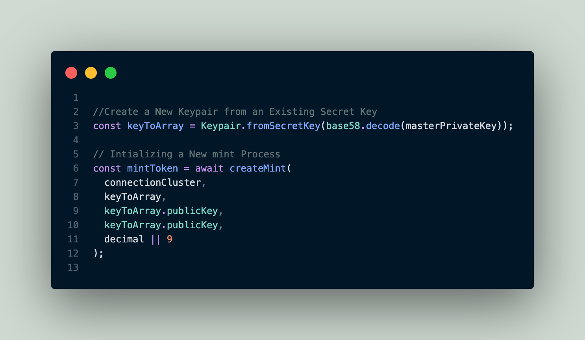
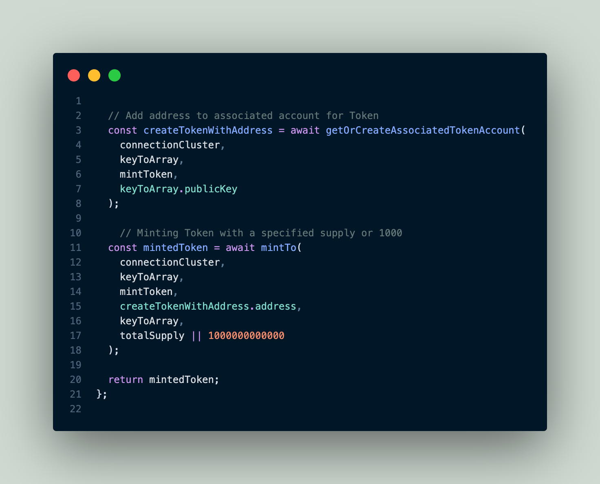
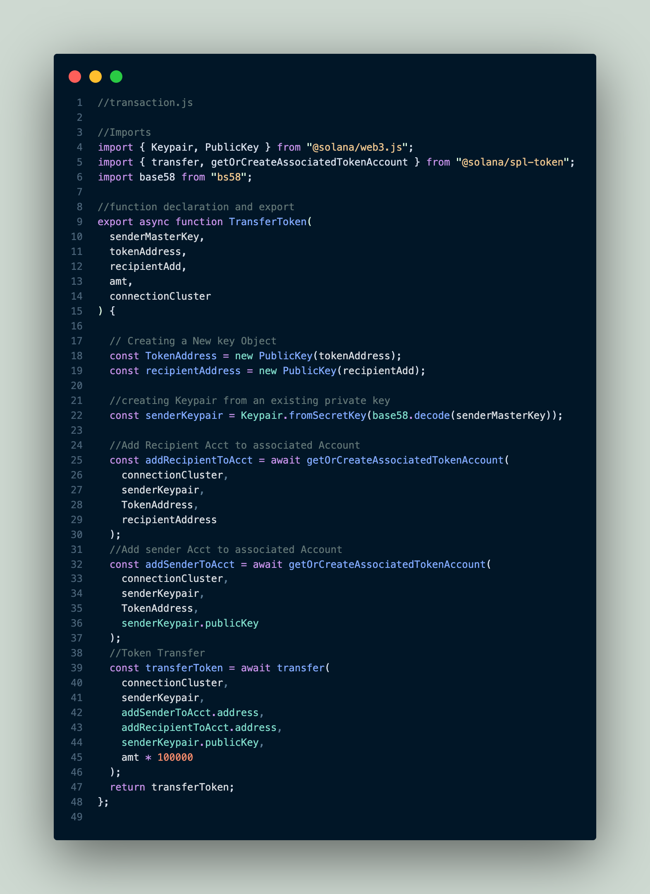

## Description

A simple project to show how tokens transfer works on solana blockchain, this use a non-custodia approach to send token
## Getting Started


### Cloning the app

* simple clone this example by using any of the github command you are comfortabel using
```
https://github.com/garantor/solanaTokenTransfer.git
```

### How to run the program

```
npm i
```
```
cd solanaDev
```
* setup an env file with a key of `SECRET_KEY` and the value will be your solana secret key.
```
npm run dev 
```
the above command `npm run dev` will run in a persistant mode and always re-run each time there is a change in any of your file. To stop this behaviour you can run the main.js file like a normal nodejs file.

## screenshots


